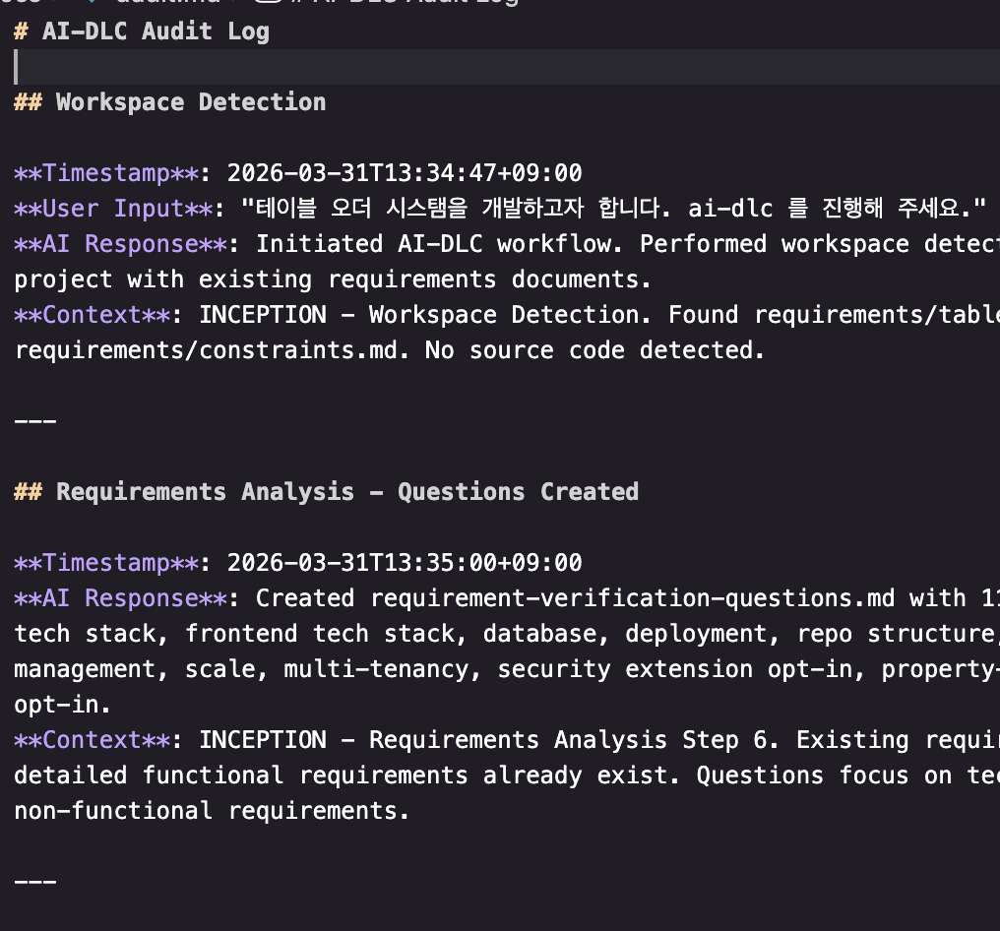
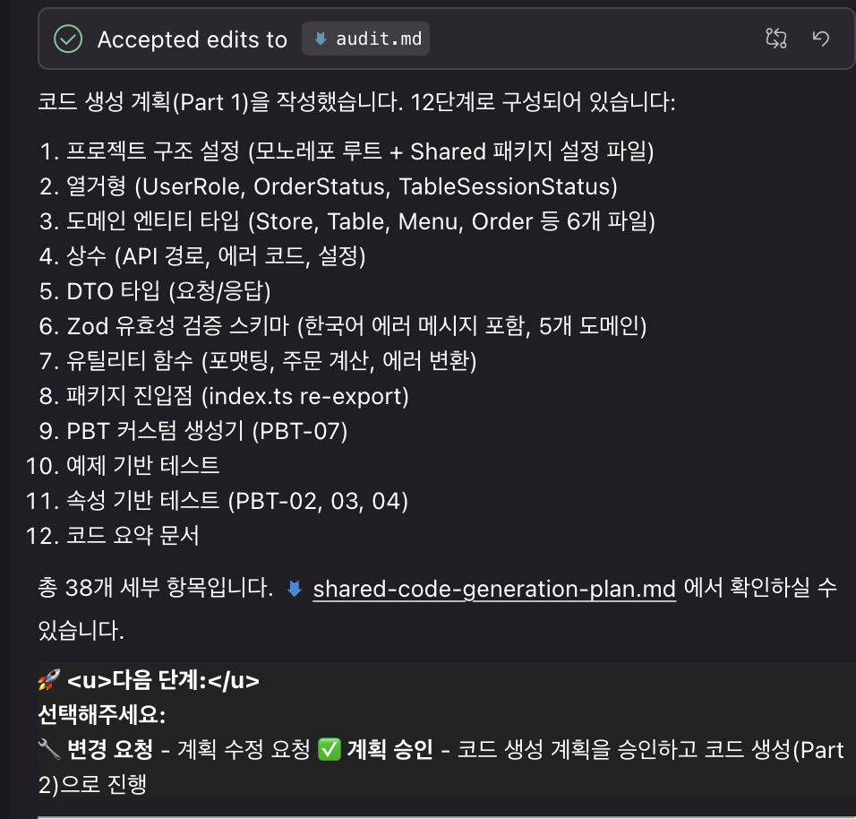
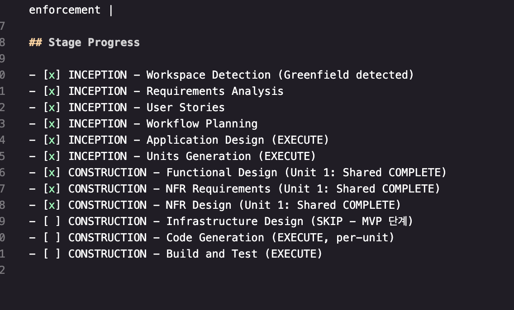

# KB금융그룹을 위한 AWS AI-DLC 부트캠프 2026 경험담

이 레포는 `awslabs/aidlc-workflows`를 fork한 내용이며, md 파일들은 AI를 활용해 한국어로 모두 번역했습니다.

원래의 README.md는 [docs/README.md](./docs/README.md)에서 확인 가능합니다.
(Claude Code, Cursor, Kiro, GitHub Copilot 등 다양한 환경에서 테스트 가능)

이 부트캠프를 통해서 경험한 내용은 2026년 주목받고 있는 **하네스 엔지니어링** — AI 에이전트를 안전하고 예측 가능하게 운용하기 위한 제어 구조(가드레일, 데이터 거버넌스, 모니터링)를 가볍게 경험했다 정도로 생각한다.

## AI-DLC

👋 Welcome to AI-DLC (AI-Driven Development Life Cycle)! 👋

복잡한 시스템을 대규모로 구축하기 위해 **AI 협업, 역할, 프로세스를 체계화한 AI 네이티브 방법론**

### AI-DLC 동작 방식

체계화된 프롬프트 체인을 따라 단계별로 실행하고 검증하는 플로우로 동작합니다. (하기 표 참고)

#### 1. INCEPTION (프로젝트 정의)

| Rules 파일               | 역할                  | 주요 산출물                                         |
| ------------------------ | --------------------- | --------------------------------------------------- |
| requirements-analysis.md | 시스템 요구사항 정의  | requirements.md                                     |
| user-stories.md          | 사용자 관점 기능 정의 | personas.md, stories.md                             |
| application-design.md    | 시스템 구조 설계      | components.md, services.md, component-dependency.md |
| units-generation.md      | 개발 단위 구성        | unit-of-work.md, unit-of-work-story-map.md          |

#### 2. CONSTRUCTION (구축)

| Rules 파일               | 역할                 | 주요 산출물                                                    |
| ------------------------ | -------------------- | -------------------------------------------------------------- |
| functional-design.md     | 비즈니스 로직 모델링 | domain-entities.md, business-rules.md, business-logic-model.md |
| nfr-requirements.md      | 비기능 요구사항 정의 | nfr-requirements.md, tech-stack-decisions.md                   |
| nfr-design.md            | 품질 속성 설계       | nfr-design-patterns.md, logical-components.md                  |
| infrastructure-design.md | 인프라 구성 설계     | infrastructure-design.md, deployment-architecture.md           |
| code-generation.md       | 코드 생성            | 실제 코드, 테스트, 배포 아티팩트                               |
| build-and-test.md        | 품질 검증            | build-instructions.md, \*-test-instructions.md                 |

#### 3. OPERATION (운영)

| Rules 파일    | 역할           | 주요 산출물        |
| ------------- | -------------- | ------------------ |
| operations.md | 운영 체계 수립 | 이번 실습에 미포함 |

## 실습 시작

Kiro 에디터를 사용했으며, 프로젝트를 다운받아서 다음 문장으로 시작했습니다.

`테이블 오더 시스템을 개발하고자 합니다. ai-dlc 를 진행해 주세요.`

### 실습 메모 1

하기 라이프사이클로 진행됨.

```
                         사용자 요청
                              |
                              v
        +---------------------------------------+
        |     INCEPTION PHASE                   |
        |     계획 및 애플리케이션 설계               |
        +---------------------------------------+
        | * Workspace Detection (항상)           |
        | * Reverse Engineering (조건부)         |
        | * Requirements Analysis (항상)         |
        | * User Stories (조건부)                |
        | * Workflow Planning (항상)            |
        | * Application Design (조건부)          |
        | * Units Generation (조건부)            |
        +---------------------------------------+
                              |
                              v
        +---------------------------------------+
        |     CONSTRUCTION PHASE                |
        |     설계, 구현 및 테스트              |
        +---------------------------------------+
        | * Per-Unit Loop (각 유닛별):            |
        |   - Functional Design (조건부)          |
        |   - NFR Requirements Assess (조건부)    |
        |   - NFR Design (조건부)                 |
        |   - Infrastructure Design (조건부)      |
        |   - Code Generation (항상)             |
        | * Build and Test (항상)                |
        +---------------------------------------+
                              |
                              v
        +---------------------------------------+
        |     OPERATIONS PHASE                  |
        |     향후 확장을 위한 플레이스홀더            |
        +---------------------------------------+
                              |
                              v
                            완료
```

### 실습 메모 2

사용자 요청에 의하여 순서대로 진행되었다.

여기서 맥락(Context)인식 개념으로 `audit.md`파일에 `AI-DLC Audit Log`가 쌓이고, 현재 트래킹하는 state는 `aidlc-state.md`에서 `## Stage Progress`로 확인할 수 있었다.

### Audit Log 샘플



### AI와 응답을 통해서 Plan을 만드는 과정



### Stage Progress 과정



## 실습 후기

우리 팀은 CONSTRUCTION 단계를 백엔드 API, Admin, 사용자 웹 서비스 3개의 unit으로 나눠 한 사람이 하나의 unit을 담당하고, 완성 후 취합하여 하나의 서비스로 동작시키는 방식으로 진행했다.

나는 unit3(사용자 웹 서비스)를 담당하여 Kiro로 유닛테스트, E2E, 모킹 서버 등이 적용된 Next.js 프로젝트를 생성했다.

팀 전체가 각 unit을 완성하고 취합하여 전체 서비스가 동작하기까지 **약 2시간**이 걸렸으며, unit3 작업에는 Kiro 기준 **약 300 Credits**을 사용했다. (월 $20에 1,000 Credits 제공)

## 회고

가볍게 AI-DLC를 경험해봤고, 회사에서 다음 프로젝트로 인프라·서버·프론트를 모두 포함하는 MVP 개발을 계획 중인데 다수의 TF 구성원이 AI-DLC로 진행하자는 데 동의했다.

이번 실습에서는 대부분의 단계를 빠르게 넘어갔지만, 실제 프로젝트라면 INCEPTION 단계에서 상세한 스펙을 정리하는 데 더 많은 시간을 투자해야겠다고 느꼈다. CONSTRUCTION 단계에서도 사용할 라이브러리와 구현 기능을 더 구체적으로 명시해주는 것이 좋을 것 같았다.
