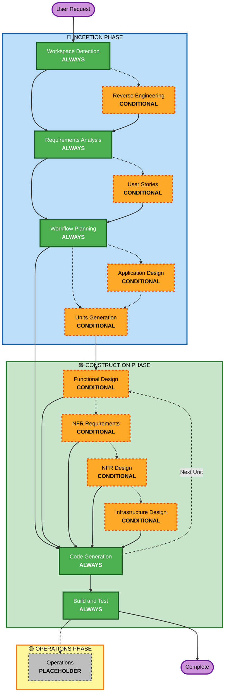

# AI-DLC 적응형 워크플로 개요

**목적**: AI 모델과 개발자가 전체 워크플로 구조를 이해하기 위한 기술 참고 자료.

**참고**: welcome-message.md(사용자 환영 메시지)와 README.md(문서)에 유사한 내용이 있습니다. 이 중복은 **의도적**입니다 — 파일마다 역할이 다릅니다:
- **이 파일**: AI 모델 컨텍스트 로딩을 위한 Mermaid 다이어그램이 있는 상세 기술 참고
- **welcome-message.md**: ASCII 다이어그램이 있는 사용자 대면 환영 메시지
- **README.md**: 저장소용 사람이 읽기 쉬운 문서

## 세 단계 생명주기:
• **INCEPTION PHASE**: 계획 및 아키텍처(Workspace Detection + 조건부 단계 + Workflow Planning)
• **CONSTRUCTION PHASE**: 설계, 구현, 빌드 및 테스트(단위별 설계 + Code Generation + Build & Test)
• **OPERATIONS PHASE**: 향후 배포·모니터링 워크플로를 위한 자리 표시자

## 적응형 워크플로:
• **Workspace Detection** (항상) → **Reverse Engineering** (brownfield만) → **Requirements Analysis** (항상, 적응형 깊이) → **조건부 단계** (필요 시) → **Workflow Planning** (항상) → **Code Generation** (항상, 단위별) → **Build and Test** (항상)

## 동작 방식:
• **AI가** 요청, 워크스페이스, 복잡도를 분석해 필요한 stage를 판단합니다
• **항상 실행되는 stage**: Workspace Detection, Requirements Analysis(적응형 깊이), Workflow Planning, Code Generation(단위별), Build and Test
• **나머지 stage는 모두 조건부**: Reverse Engineering, User Stories, Application Design, Units Generation, 단위별 설계 stage(Functional Design, NFR Requirements, NFR Design, Infrastructure Design)
• **고정 순서 없음**: stage는 특정 작업에 맞는 순서로 실행됩니다

## 팀의 역할:
• 전용 질문 파일에서 [Answer]: 태그와 글자 선택(A, B, C, D, E)으로 **질문에 답합니다**
• **옵션 E 사용 가능**: 제공된 옵션이 맞지 않으면 "Other"를 선택하고 사용자 정의 응답을 설명합니다
• 진행 전 각 phase를 **팀으로 검토·승인**합니다
• 필요 시 아키텍처 접근을 **함께 결정**합니다
• **중요**: 팀 작업입니다 — 각 phase에 관련 이해관계자를 참여시킵니다

## AI-DLC 세 단계 워크플로:

**Stage 설명:**

**🔵 INCEPTION PHASE** — 계획 및 아키텍처
- Workspace Detection: 워크스페이스 상태와 프로젝트 유형 분석(ALWAYS)
- Reverse Engineering: 기존 코드베이스 분석(CONDITIONAL — Brownfield만)
- Requirements Analysis: 요구사항 수집·검증(ALWAYS — 적응형 깊이)
- User Stories: user stories 및 페르소나 작성(CONDITIONAL)
- Workflow Planning: 실행 계획 작성(ALWAYS)
- Application Design: 상위 수준 컴포넌트 식별 및 서비스 레이어 설계(CONDITIONAL)
- Units Generation: 작업 단위로 분해(CONDITIONAL)

**🟢 CONSTRUCTION PHASE** — 설계, 구현, 빌드 및 테스트
- Functional Design: 단위별 상세 비즈니스 로직 설계(CONDITIONAL, 단위별)
- NFR Requirements: NFR 결정 및 기술 스택 선택(CONDITIONAL, 단위별)
- NFR Design: NFR 패턴 및 논리 컴포넌트 반영(CONDITIONAL, 단위별)
- Infrastructure Design: 실제 인프라 서비스에 매핑(CONDITIONAL, 단위별)
- Code Generation: Part 1 - Planning, Part 2 - Generation으로 코드 생성(ALWAYS, 단위별)
- Build and Test: 모든 단위 빌드 및 포괄적 테스트 실행(ALWAYS)

**🟡 OPERATIONS PHASE** — 자리 표시자
- Operations: 향후 배포·모니터링 워크플로를 위한 자리 표시자(PLACEHOLDER)

**핵심 원칙:**
- 가치를 더할 때만 phase가 실행됩니다
- 각 phase는 독립적으로 평가됩니다
- INCEPTION은 "what"과 "why"에 초점
- CONSTRUCTION은 "how"와 "build and test"에 초점
- OPERATIONS는 향후 확장을 위한 자리 표시자입니다
- 단순한 변경은 조건부 INCEPTION stage를 건너뛸 수 있습니다
- 복잡한 변경은 전체 INCEPTION 및 CONSTRUCTION 절차를 거칩니다
