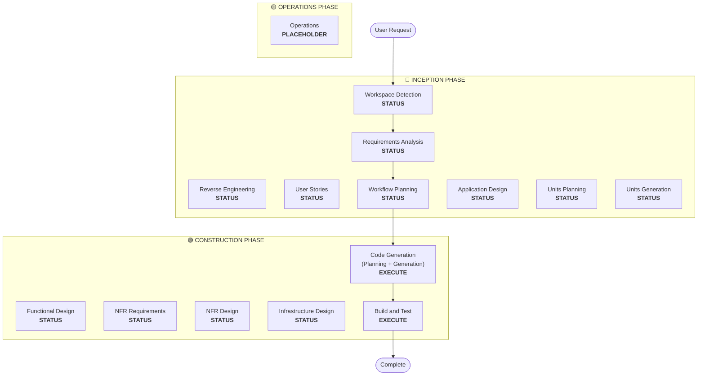

# Workflow Planning

**목적**: 실행할 phase를 결정하고 포괄적인 실행 계획을 작성합니다

**항상 실행**: 요구사항과 범위를 파악한 뒤 항상 이 단계가 실행됩니다

## Step 1: 이전 맥락 전부 로드

### 1.1 Reverse Engineering 산출물 로드(brownfield인 경우)
- architecture.md
- component-inventory.md
- technology-stack.md
- dependencies.md

### 1.2 Requirements Analysis 로드
- requirements.md (의도 분석 포함)
- requirement-verification-questions.md (답변 포함)

### 1.3 User Stories 로드(실행한 경우)
- stories.md
- personas.md

## Step 2: 상세 범위 및 영향 분석

**이제 맥락이 완전합니다(요구사항 + 스토리). 상세 분석을 수행합니다:**

### 2.1 변환 범위 탐지(Brownfield만)

**brownfield 프로젝트이면** 변환 범위를 분석합니다:

#### 아키텍처 변환
- **단일 컴포넌트 변경** 대 **아키텍처 변환**
- **인프라 변경** 대 **애플리케이션 변경**
- **배포 모델 변경** (Lambda→Container, EC2→Serverless 등)

#### 관련 컴포넌트 식별
변환의 경우 다음을 식별합니다:
- 갱신이 필요한 **인프라 코드**
- 변경이 필요한 **CDK 스택**
- **API Gateway** 설정
- **로드 밸런서** 요구사항
- 필요한 **네트워킹** 변경
- **모니터링/로깅** 조정

#### 크로스 패키지 영향
- 갱신이 필요한 **CDK 인프라** 패키지
- 버전 갱신이 필요한 **공유 모델**
- 엔드포인트 변경이 필요한 **클라이언트 라이브러리**
- 새 테스트 시나리오가 필요한 **테스트 패키지**

### 2.2 변경 영향 평가

#### 영향 영역
1. **사용자 대면 변경**: 사용자 경험에 영향을 주는가?
2. **구조적 변경**: 시스템 아키텍처를 바꾸는가?
3. **데이터 모델 변경**: DB 스키마나 데이터 구조에 영향을 주는가?
4. **API 변경**: 인터페이스나 계약에 영향을 주는가?
5. **NFR 영향**: 성능, 보안, 확장성에 영향을 주는가?

#### 애플리케이션 레이어 영향(해당 시)
- **코드 변경**: 새 진입점, 어댑터, 설정
- **의존성**: 새 라이브러리, 프레임워크 변경
- **설정**: 환경 변수, 설정 파일
- **테스트**: 단위 테스트, 통합 테스트

#### 인프라 레이어 영향(해당 시)
- **배포 모델**: Lambda→ECS, EC2→Fargate 등
- **네트워킹**: VPC, 보안 그룹, 로드 밸런서
- **스토리지**: 영구 볼륨, 공유 스토리지
- **스케일링**: Auto Scaling 정책, 용량 계획

#### 운영 레이어 영향(해당 시)
- **모니터링**: CloudWatch, 커스텀 메트릭, 대시보드
- **로깅**: 로그 집계, 구조화 로깅
- **알람**: 알람 설정, 알림 채널
- **배포**: CI/CD 파이프라인 변경, 롤백 전략

### 2.3 컴포넌트 관계 매핑(Brownfield만)

**brownfield 프로젝트이면** 컴포넌트 의존성 그래프를 만듭니다:

```markdown
## Component Relationships
- **Primary Component**: [변경 중인 패키지]
- **Infrastructure Components**: [CDK/Terraform 패키지]
- **Shared Components**: [모델, 유틸, 클라이언트]
- **Dependent Components**: [이 컴포넌트를 호출하는 서비스]
- **Supporting Components**: [모니터링, 로깅, 배포]
```

관련 컴포넌트마다:
- **Change Type**: Major, Minor, Configuration-only
- **Change Reason**: 직접 의존성, 배포 모델, 네트워킹
- **Change Priority**: Critical, Important, Optional

### 2.4 위험 평가

위험 수준을 평가합니다:
1. **Low**: 고립된 변경, 롤백 용이, 잘 이해됨
2. **Medium**: 여러 컴포넌트, 중간 롤백 난이도, 일부 미지수
3. **High**: 시스템 전반 영향, 복잡한 롤백, 상당한 미지수
4. **Critical**: 프로덕션 핵심, 롤백 어려움, 높은 불확실성

## Step 3: Phase 결정

### 3.1 User Stories — 이미 실행했거나 건너뛸까?
**이미 실행함**: 다음 판단으로 이동
**실행하지 않음 — 다음이면 실행**:
- 여러 사용자 페르소나
- 사용자 경험 영향
- 수락 기준 필요
- 팀 협업 필요

**건너뛸 경우**:
- 내부 리팩터링
- 재현이 명확한 버그 수정
- 기술 부채 감소
- 인프라 변경

### 3.2 Application Design — 실행 조건:
- 새 컴포넌트나 서비스 필요
- 컴포넌트 메서드와 비즈니스 규칙 정의 필요
- 서비스 레이어 설계 필요
- 컴포넌트 의존성 명확화 필요

**건너뛸 경우**:
- 기존 컴포넌트 경계 내 변경
- 새 컴포넌트나 메서드 없음
- 순수 구현 변경

### 3.3 Design (Units Planning/Generation) — 실행 조건:
- 새 데이터 모델이나 스키마
- API 변경 또는 새 엔드포인트
- 복잡한 알고리즘이나 비즈니스 로직
- 상태 관리 변경
- 여러 패키지 변경 필요
- Infrastructure-as-code 갱신 필요

**건너뛸 경우**:
- 단순 로직 변경
- UI만 변경
- 설정 업데이트
- 직관적인 구현

### 3.4 NFR Implementation — 실행 조건:
- 성능 요구사항
- 보안 고려
- 확장성 우려
- 모니터링/관측 필요

**건너뛸 경우**:
- 기존 NFR 설정으로 충분
- 새 NFR 요구 없음
- NFR 영향 없는 단순 변경

## Step 4: 적응형 상세 참고

**적응형 상세 설명은 [depth-levels.md](../common/depth-levels.md) 참고**

실행할 각 단계에 대해:
- 정의된 산출물이 모두 생성됨
- 산출물 내 상세 수준은 문제 복잡도에 맞게 조정됨
- 모델이 문제 특성에 따라 적절한 상세도를 판단함

## Step 5: 다중 모듈 조정 분석(Brownfield만)

**여러 모듈/패키지가 있는 brownfield이면** 의존성을 분석하고 최적 갱신 전략을 결정합니다:

### 5.1 모듈 의존성 분석
- 빌드 시스템 의존성과 의존성 매니페스트 검토
- 빌드 타임 대 런타임 의존성 식별
- 모듈 간 API 계약과 공유 인터페이스 매핑

### 5.2 갱신 전략 결정
의존성 분석을 바탕으로 결정:
- **갱신 순서**: 의존성 때문에 먼저 갱신해야 하는 모듈
- **병렬화 기회**: 동시에 갱신할 수 있는 모듈
- **조정 요구**: 버전 호환, API 계약, 배포 순서
- **테스트 전략**: 모듈별 대 통합 테스트 접근
- **롤백 전략**: 중간에 실패할 경우 복구 계획

### 5.3 조정 계획 문서화
```markdown
## Module Update Strategy
- **Update Approach**: [Sequential/Parallel/Hybrid]
- **Critical Path**: [다른 갱신을 막는 모듈]
- **Coordination Points**: [공유 API, 인프라, 데이터 계약]
- **Testing Checkpoints**: [통합을 검증할 시점]
```

영향을 받는 모듈마다 식별:
- **갱신 우선순위**: 먼저 갱신해야 함 대 나중에 갱신 가능
- **의존성 제약**: 무엇에 의존하는지, 무엇이 자신에 의존하는지
- **변경 범위**: Major(호환 깨짐), Minor(호환), Patch(수정)

## Step 6: 워크플로 시각화 생성

다음을 보여주는 Mermaid 플로차트 생성:
- 순서대로 모든 phase
- 조건부 phase마다 EXECUTE 또는 SKIP 결정
- 각 phase 상태에 맞는 스타일

**스타일 규칙** (플로차트 뒤에 추가):
```
style WD fill:#4CAF50,stroke:#1B5E20,stroke-width:3px,color:#fff
style CG fill:#4CAF50,stroke:#1B5E20,stroke-width:3px,color:#fff
style BT fill:#4CAF50,stroke:#1B5E20,stroke-width:3px,color:#fff
style US fill:#BDBDBD,stroke:#424242,stroke-width:2px,stroke-dasharray: 5 5,color:#000
style Start fill:#CE93D8,stroke:#6A1B9A,stroke-width:3px,color:#000
style End fill:#CE93D8,stroke:#6A1B9A,stroke-width:3px,color:#000

linkStyle default stroke:#333,stroke-width:2px
```

**스타일 가이드**:
- 완료/항상 실행: `fill:#4CAF50,stroke:#1B5E20,stroke-width:3px,color:#fff` (Material Green, 흰 글자)
- 조건부 EXECUTE: `fill:#FFA726,stroke:#E65100,stroke-width:3px,stroke-dasharray: 5 5,color:#000` (Material Orange, 검정 글자)
- 조건부 SKIP: `fill:#BDBDBD,stroke:#424242,stroke-width:2px,stroke-dasharray: 5 5,color:#000` (Material Gray, 검정 글자)
- 시작/종료: `fill:#CE93D8,stroke:#6A1B9A,stroke-width:3px,color:#000` (Material Purple, 검정 글자)
- Phase 컨테이너: 더 밝은 Material 색 사용 (INCEPTION: #BBDEFB, CONSTRUCTION: #C8E6C9, OPERATIONS: #FFF59D)

## Step 7: 실행 계획 문서 작성

`aidlc-docs/inception/plans/execution-plan.md` 생성:

```markdown
# Execution Plan

## Detailed Analysis Summary

### Transformation Scope (Brownfield Only)
- **Transformation Type**: [Single component/Architectural/Infrastructure]
- **Primary Changes**: [설명]
- **Related Components**: [목록]

### Change Impact Assessment
- **User-facing changes**: [Yes/No - 설명]
- **Structural changes**: [Yes/No - 설명]
- **Data model changes**: [Yes/No - 설명]
- **API changes**: [Yes/No - 설명]
- **NFR impact**: [Yes/No - 설명]

### Component Relationships (Brownfield Only)
[컴포넌트 의존성 그래프]

### Risk Assessment
- **Risk Level**: [Low/Medium/High/Critical]
- **Rollback Complexity**: [Easy/Moderate/Difficult]
- **Testing Complexity**: [Simple/Moderate/Complex]

## Workflow Visualization



**참고**: STATUS 자리표시자를 실제 phase 상태(COMPLETED/SKIP/EXECUTE)로 바꾸고 적절한 스타일을 적용합니다

## 실행할 Phases

### 🔵 INCEPTION PHASE
- [x] Workspace Detection (COMPLETED)
- [x] Reverse Engineering (COMPLETED/SKIPPED)
- [x] Requirements Analysis (COMPLETED)
- [x] User Stories (COMPLETED/SKIPPED)
- [x] Execution Plan (IN PROGRESS)
- [ ] Application Design - [EXECUTE/SKIP]
  - **Rationale**: [실행 또는 건너뛰는 이유]
- [ ] Units Planning - [EXECUTE/SKIP]
  - **Rationale**: [실행 또는 건너뛰는 이유]
- [ ] Units Generation - [EXECUTE/SKIP]
  - **Rationale**: [실행 또는 건너뛰는 이유]

### 🟢 CONSTRUCTION PHASE
- [ ] Functional Design - [EXECUTE/SKIP]
  - **Rationale**: [실행 또는 건너뛰는 이유]
- [ ] NFR Requirements - [EXECUTE/SKIP]
  - **Rationale**: [실행 또는 건너뛰는 이유]
- [ ] NFR Design - [EXECUTE/SKIP]
  - **Rationale**: [실행 또는 건너뛰는 이유]
- [ ] Infrastructure Design - [EXECUTE/SKIP]
  - **Rationale**: [실행 또는 건너뛰는 이유]
- [ ] Code Generation - EXECUTE (ALWAYS)
  - **Rationale**: 구현 계획과 코드 생성 필요
- [ ] Build and Test - EXECUTE (ALWAYS)
  - **Rationale**: 빌드, 테스트, 검증 필요

### 🟡 OPERATIONS PHASE
- [ ] Operations - PLACEHOLDER
  - **Rationale**: 향후 배포 및 모니터링 워크플로

## Package Change Sequence (Brownfield Only)
[해당 시 의존성과 함께 패키지 갱신 순서 목록]

## Estimated Timeline
- **Total Phases**: [개수]
- **Estimated Duration**: [시간 추정]

## Success Criteria
- **Primary Goal**: [주요 목표]
- **Key Deliverables**: [목록]
- **Quality Gates**: [목록]

[brownfield인 경우]
- **Integration Testing**: 모든 컴포넌트가 함께 동작함
- **Operational Readiness**: 모니터링, 로깅, 알람이 동작함
```

## Step 8: 상태 추적 초기화

`aidlc-docs/aidlc-state.md` 갱신:

```markdown
# AI-DLC State Tracking

## Project Information
- **Project Type**: [Greenfield/Brownfield]
- **Start Date**: [ISO 타임스탬프]
- **Current Stage**: INCEPTION - Workflow Planning

## Execution Plan Summary
- **Total Stages**: [개수]
- **Stages to Execute**: [목록]
- **Stages to Skip**: [이유와 함께 목록]

## Stage Progress

### 🔵 INCEPTION PHASE
- [x] Workspace Detection
- [x] Reverse Engineering (해당 시)
- [x] Requirements Analysis
- [x] User Stories (해당 시)
- [x] Workflow Planning
- [ ] Application Design - [EXECUTE/SKIP]
- [ ] Units Planning - [EXECUTE/SKIP]
- [ ] Units Generation - [EXECUTE/SKIP]

### 🟢 CONSTRUCTION PHASE
- [ ] Functional Design - [EXECUTE/SKIP]
- [ ] NFR Requirements - [EXECUTE/SKIP]
- [ ] NFR Design - [EXECUTE/SKIP]
- [ ] Infrastructure Design - [EXECUTE/SKIP]
- [ ] Code Generation - EXECUTE
- [ ] Build and Test - EXECUTE

### 🟡 OPERATIONS PHASE
- [ ] Operations - PLACEHOLDER

## Current Status
- **Lifecycle Phase**: INCEPTION
- **Current Stage**: Workflow Planning Complete
- **Next Stage**: [실행할 다음 단계]
- **Status**: Ready to proceed
```

## Step 9: 사용자에게 계획 제시

```markdown
# 📋 Workflow Planning Complete

다음을 바탕으로 포괄적인 실행 계획을 작성했습니다:
- 요청: [요약]
- 기존 시스템: [brownfield인 경우 요약]
- 요구사항: [실행한 경우 요약]
- User stories: [실행한 경우 요약]

**상세 분석**:
- 위험 수준: [수준]
- 영향: [주요 영향 요약]
- 영향을 받는 컴포넌트: [목록]

**권장 실행 계획**:

[X]개 단계 실행을 권장합니다:

🔵 **INCEPTION PHASE:**
1. [단계 이름] - *근거:* [실행 이유]
2. [단계 이름] - *근거:* [실행 이유]
...

🟢 **CONSTRUCTION PHASE:**
3. [단계 이름] - *근거:* [실행 이유]
4. [단계 이름] - *근거:* [실행 이유]
...

[Y]개 단계 건너뛰기를 권장합니다:

🔵 **INCEPTION PHASE:**
1. [단계 이름] - *근거:* [건너뛰는 이유]
2. [단계 이름] - *근거:* [건너뛰는 이유]
...

🟢 **CONSTRUCTION PHASE:**
3. [단계 이름] - *근거:* [건너뛰는 이유]
4. [단계 이름] - *근거:* [건너뛰는 이유]
...

[다중 패키지 brownfield인 경우]
**권장 패키지 갱신 순서**:
1. [패키지] - [이유]
2. [패키지] - [이유]
...

**예상 일정**: [기간]

> **📋 <u>**검토 필요:**</u>**  
> 다음 경로의 실행 계획을 검토하세요: `aidlc-docs/inception/plans/execution-plan.md`

> **🚀 <u>**다음 단계**</u>**
>
> **선택할 수 있는 항목:**
>
> 🔧 **변경 요청** - 필요 시 실행 계획 수정을 요청합니다
> [건너뛴 단계가 있는 경우:]
> 📝 **건너뛴 단계 추가** - 현재 SKIP으로 표시된 단계를 포함하도록 선택합니다
> ✅ **승인 후 계속** - 계획을 승인하고 **[다음 단계 이름]**으로 진행합니다
```

## Step 10: 사용자 응답 처리

- **승인한 경우**: 실행 계획의 다음 단계로 진행
- **변경을 요청한 경우**: 실행 계획을 갱신하고 다시 확인
- **단계를 강제로 포함/제외하려는 경우**: 그에 맞게 계획 갱신

## Step 11: 상호작용 로깅

`aidlc-docs/audit.md`에 기록:

```markdown
## Workflow Planning - Approval
**Timestamp**: [ISO 타임스탬프]
**AI Prompt**: "Ready to proceed with this plan?"
**User Response**: "[사용자의 완전한 원문 응답]"
**Status**: [Approved/Changes Requested]
**Context**: [X]개 단계를 실행하는 워크플로 계획 작성됨

---
```
