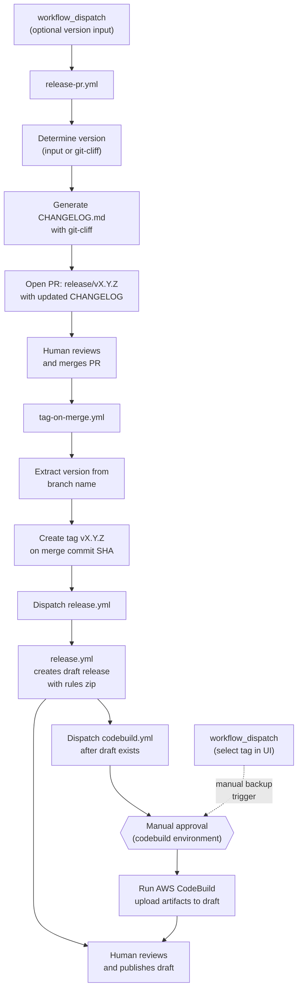
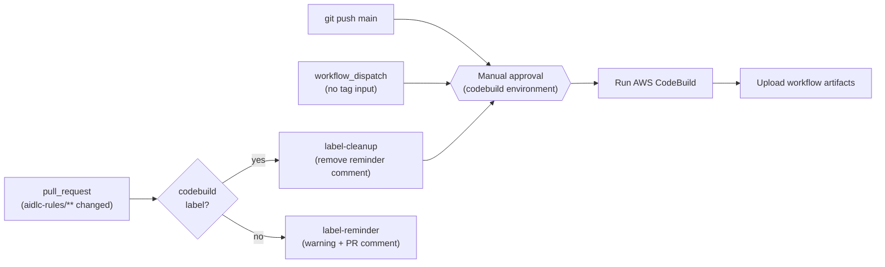
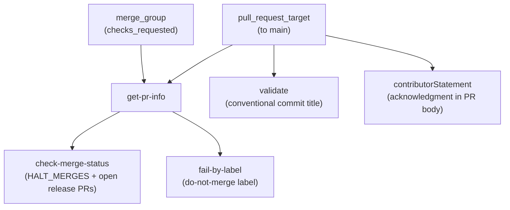

# 관리자 가이드

이 가이드는 `awslabs/aidlc-workflows` 저장소의 CI/CD 인프라, GitHub 워크플로, 보호된 환경, 시크릿, 변수, 권한, 릴리스 프로세스를 설명합니다.

**대상:** 저장소 관리자, 유지보수 담당자, 이 저장소에서 작업하는 AI 코딩 에이전트.

**관련 문서:**
- [개발자 가이드](DEVELOPERS_GUIDE.md) — 로컬에서 빌드 실행(CodeBuild + `act`)
- [기여 가이드](../CONTRIBUTING.md) — 기여 절차와 관례
- [README](../README.md) — 사용자용 설정과 사용법

---

## 목차

- [저장소 개요](#repository-overview)
- [CI/CD 아키텍처](#cicd-architecture)
- [워크플로 참조](#workflow-reference)
  - [Release PR 워크플로](#release-pr-workflow-release-pryml)
  - [Tag Release 워크플로](#tag-release-workflow-tag-on-mergeyml)
  - [CodeBuild 워크플로](#codebuild-workflow-codebuildyml)
  - [Release 워크플로](#release-workflow-releaseyml)
  - [Pull Request 검증 워크플로](#pull-request-validation-workflow-pull-request-lintyml)
- [보호된 환경](#protected-environments)
- [시크릿과 변수](#secrets-and-variables)
- [권한 모델](#permissions-model)
- [보안 태세](#security-posture)
- [코드 소유권](#code-ownership)
- [릴리스 프로세스](#release-process)
- [Changelog 설정](#changelog-configuration)

---

## Repository Overview

이 저장소는 **AI-DLC (AI-Driven Development Life Cycle)** 방법론을 `aidlc-rules/` 아래 마크다운 규칙 파일 집합으로 제공합니다. CI/CD 인프라는 다음을 담당합니다.

- AWS CodeBuild를 통한 **지속적 통합**(평가 및 리포팅)
- GitHub Releases를 통한 **릴리스 배포**(규칙 파일 zip)
- git-cliff를 통한 **Changelog 생성**(changelog-first: 릴리스 전에 갱신, 태그 커밋에 포함)

```
awslabs/aidlc-workflows/
├── .github/
│   ├── CODEOWNERS
│   ├── ISSUE_TEMPLATE/           # Bug, feature, RFC, docs templates
│   ├── pull_request_template.md  # PR template with contributor statement
│   └── workflows/
│       ├── codebuild.yml         # CI via AWS CodeBuild
│       ├── pull-request-lint.yml # PR validation (title, labels, merge gates)
│       ├── release.yml           # GitHub Release on tag push
│       ├── release-pr.yml        # Changelog PR before release
│       └── tag-on-merge.yml      # Auto-tag on release PR merge
├── .claude/
│   └── settings.json             # Shared Claude Code project settings
├── aidlc-rules/                  # The distributable product
│   ├── aws-aidlc-rules/          # Core workflow rules
│   └── aws-aidlc-rule-details/   # Detailed rules by phase
├── cliff.toml                    # git-cliff changelog configuration
├── docs/
│   ├── ADMINISTRATIVE_GUIDE.md   # This file
│   └── DEVELOPERS_GUIDE.md       # Local build instructions
└── scripts/
    └── aidlc-evaluator/          # Evaluation framework (in development)
```

---

## CI/CD Architecture

다섯 개의 워크플로가 서로 다른 파이프라인 두 개와 풀 리퀘스트 검증 게이트를 구성합니다.

### 파이프라인 1: Release (changelog-first)



The release flow is **changelog-first**: the CHANGELOG is updated *before* the tag is created, so the tagged commit always contains its own changelog entry. The flow has three human touchpoints:

1. **Merge the release PR** — reviews the changelog, triggers automatic tagging
2. **Approve the CodeBuild environment** — gates access to AWS credentials for the build
3. **Publish the draft release** — reviews artifacts, makes the release public

`tag-on-merge.yml` explicitly dispatches `release.yml` and `codebuild.yml` via `gh workflow run --ref vX.Y.Z` after creating the tag. The dispatches are **sequential**: `release.yml` runs first and is watched to completion so that the draft release exists before `codebuild.yml` uploads artifacts. This is necessary because tags created with `GITHUB_TOKEN` do not trigger `on: push: tags` events — but `workflow_dispatch` is exempt from this limitation. Both workflows also retain `push: tags: v*` as a fallback for manual tag pushes. The `codebuild.yml` workflow requires **manual approval** via the `codebuild` protected environment before the build proceeds. The upload step handles all release states resiliently:
- **Draft exists** (normal case) — `release.yml` finishes in ~30s creating the draft; CodeBuild takes minutes, so the draft is ready when artifacts are uploaded
- **No release yet** (codebuild finished first) — creates a draft with build artifacts; `release.yml` will update it later
- **Already published** (re-run) — attempts to replace artifacts, warns gracefully if immutable

**Backup strategy:** If the tag-triggered CodeBuild run fails or is blocked, an admin can manually dispatch the workflow via `workflow_dispatch` and select the `v*` tag in the GitHub UI branch/tag selector. Since `github.ref` resolves to the selected tag, the upload step activates automatically.

### Pipeline 2: Continuous Integration



### 파이프라인 3: Pull Request 검증



`pull-request-lint.yml`은 `main`을 대상으로 하는 모든 PR과 머지 큐 검사에서 실행됩니다. 네 가지 게이트를 강제합니다. conventional commit 형식의 PR 제목, PR 템플릿의 기여자 진술, 설정 가능한 병합 중단(merge-halt) 메커니즘, do-not-merge 라벨 검사입니다. 워크플로는 `pull_request`가 아니라 `pull_request_target`을 사용해 베이스 브랜치 맥락에서 실행됩니다. PR 코드를 체크아웃하지 않으므로 안전합니다.

---

## Workflow Reference

### Release PR 워크플로 (`release-pr.yml`)

| 속성        | 값                                             |
| --------------- | ------------------------------------------------- |
| **파일**        | `.github/workflows/release-pr.yml`                |
| **트리거**     | `workflow_dispatch`, 선택 입력 `version` |
| **환경** | _(없음)_                                          |
| **러너**      | `ubuntu-latest`                                   |

**목적:** git-cliff로 conventional commit에서 갱신된 `CHANGELOG.md`를 생성하고 `release/vX.Y.Z` 브랜치에 PR을 엽니다. changelog-first 릴리스 흐름의 첫 단계입니다.

**잡: `release-pr` ("Create Release PR")**

| 단계 | 이름                     | 동작                                                                                                                                     |
| ---- | ------------------------ | ------------------------------------------------------------------------------------------------------------------------------------------ |
| 1    | 코드 체크아웃            | `actions/checkout`, `fetch-depth: 0`(git-cliff용 전체 이력)                                                                      |
| 2    | git-cliff 설치        | `orhun/git-cliff-action`으로 CLI 사용 가능                                                                                         |
| 3    | 버전 결정        | `inputs.version`(semver 검증) 또는 `git-cliff --bumped-version` 자동 감지. 최신 태그에서 패치 범프로 폴백 |
| 4    | 태그 미존재 확인 | 대상 태그가 이미 있으면 조기 실패                                                                                                |
| 5    | changelog 생성       | `orhun/git-cliff-action`, `--tag vX.Y.Z`로 `CHANGELOG.md` 생성                                                                    |
| 6    | 릴리스 PR 생성        | 브랜치 중복 없음 확인, 커밋, `release/vX.Y.Z` 푸시, PR 열기(저장소에 있으면 `release` 라벨)          |

**버전 감지:** 버전을 지정하면 유효한 semver(`MAJOR.MINOR.PATCH`)여야 하며 `v0.2.0`과 `0.2.0` 모두 허용됩니다. 미지정 시 `git-cliff --bumped-version`이 conventional commit 접두로 다음 버전을 결정합니다. `cliff.toml`의 `[bump]` 설정이 규칙을 제어합니다(예: `feat` → 마이너, breaking change → 메이저). conventional commit이 없으면 최신 태그에서 패치 범프로 폴백합니다. 태그가 전혀 없으면 경고만 내고 깔끔히 종료합니다(PR 미생성).

**외부 액션(SHA 고정):**

| Action                   | Version | SHA                                        |
| ------------------------ | ------- | ------------------------------------------ |
| `actions/checkout`       | v6.0.1  | `8e8c483db84b4bee98b60c0593521ed34d9990e8` |
| `orhun/git-cliff-action` | v4.7.0  | `e16f179f0be49ecdfe63753837f20b9531642772` |

---

### Tag Release 워크플로 (`tag-on-merge.yml`)

| 속성        | 값                                                 |
| --------------- | ----------------------------------------------------- |
| **파일**        | `.github/workflows/tag-on-merge.yml`                  |
| **트리거**     | `pull_request: types: [closed]`                       |
| **조건**   | PR이 병합되었고 브랜치 이름이 `release/v`로 시작 |
| **환경** | _(없음)_                                              |
| **러너**      | `ubuntu-latest`                                       |

**목적:** 릴리스 PR이 병합되면 병합 커밋에 버전 태그를 자동 생성한 뒤 `release.yml`을 디스패치하고(완료까지 대기) 이어서 `codebuild.yml`을 디스패치합니다.

**잡: `tag` ("Create Release Tag")**

| 단계 | 이름                               | 동작                                                                                      |
| ---- | ---------------------------------- | ------------------------------------------------------------------------------------------- |
| 1    | 태그 생성                         | 브랜치 이름에서 버전 추출, 태그 미존재 확인, GitHub API로 생성           |
| 2    | release 워크플로 디스패치 및 대기 | `gh workflow run release.yml --ref $TAG --repo $REPO`, 이후 `gh run watch`로 완료까지 대기 |
| 3    | codebuild 워크플로 디스패치        | `gh workflow run codebuild.yml --ref $TAG --repo $REPO`(초안 릴리스 존재 후 실행)   |

**태그 생성:** `gh api repos/.../git/refs`로 lightweight 태그를 만듭니다.

**워크플로 디스패치:** `GITHUB_TOKEN`으로 만든 태그는 다른 워크플로에서 `on: push: tags` 이벤트를 트리거하지 않습니다. 이를 우회하기 위해 `tag-on-merge.yml`이 `gh workflow run --ref $TAG`로 `release.yml`과 `codebuild.yml`을 명시적으로 디스패치합니다. `workflow_dispatch` 이벤트는 이 `GITHUB_TOKEN` 제한에서 제외됩니다. `--ref`가 태그로 설정되면 두 워크플로 모두 `github.ref = refs/tags/vX.Y.Z`를 보게 되어 실제 태그 푸시와 동일합니다. 디스패치는 **순차적**입니다. `release.yml`이 먼저 실행되고(`gh run watch`로 감시) 초안 릴리스가 존재한 뒤 `codebuild.yml`이 아티팩트를 업로드합니다. 릴리스 실행을 찾지 못하거나 실패해도 `codebuild.yml`은 폴백으로 디스패치됩니다.

**보안:** 브랜치 이름 `release/vX.Y.Z`는 환경 변수로 전달되며(직접 보간 없음) 명령 주입을 방지합니다. 잡 수준 `if` 조건은 `github.event.pull_request.merged == true`로 병합된 PR만 태깅하도록 합니다.

---

### CodeBuild 워크플로 (`codebuild.yml`)

| 속성        | 값                                                                                                                                                    |
| --------------- | -------------------------------------------------------------------------------------------------------------------------------------------------------- |
| **파일**        | `.github/workflows/codebuild.yml`                                                                                                                        |
| **트리거**    | `main`에 `push`, `v*` 태그 `push`, `main` 대상 `pull_request`(라벨·경로 필터), `workflow_dispatch`(`tag-on-merge.yml`에서 디스패치 또는 수동 — UI에서 태그를 고르면 릴리스 빌드) |
| **환경** | `codebuild`(보호됨, 수동 승인)                                                                                                                 |
| **러너**      | `ubuntu-latest`                                                                                                                                          |
| **동시성** | `{workflow}-{ref}`로 그룹화, 진행 중인 실행 취소                                                                                                        |

**목적:** AWS CodeBuild 프로젝트를 실행하고, S3에서 주·보조 아티팩트를 내려받아 GitHub Actions 캐시에 저장한 뒤 워크플로 아티팩트로 업로드하고,(`v*` 태그로 트리거된 경우) GitHub Release에 붙입니다.

**PR 라벨 게이트:** `pull_request` 이벤트에서는 `aidlc-rules/**`가 변경된 경우에만(`paths` 필터) 워크플로가 돌고, `build` 잡은 PR에 `codebuild` 라벨이 있을 때만(`contains(github.event.pull_request.labels.*.name, 'codebuild')`) 실행됩니다. 트리거에 `types: [opened, synchronize, reopened, labeled]`가 포함되어 라벨이 붙은 PR에 이후 푸시가 있으면 빌드가 자동으로 다시 트리거됩니다. `push`, `workflow_dispatch`, 태그 이벤트는 라벨 검사를 건너뜁니다.

**잡: `label-reminder`** (PR만, `codebuild` 라벨 없음)

| 단계 | 이름                             | 동작                                                                                     |
| ---- | -------------------------------- | ------------------------------------------------------------------------------------------ |
| 1    | codebuild 라벨 누락 경고 | Actions 요약에 보이는 `::warning::` 주석을 내보냄                           |
| 2    | PR에 코멘트                    | 일회성 PR 코멘트 게시(멱등 — 알림 코멘트가 이미 있으면 생략)     |

이 잡은 `aidlc-rules/**`가 바뀌었지만 `codebuild` 라벨이 없는 `pull_request`에서만 실행됩니다. 평가 파이프라인이 트리거되지 않았음을 유지보수 담당자와 리뷰어에게 알립니다. HTML 주석 마커(`<!-- codebuild-label-reminder -->`)로 PR당 한 번만 코멘트합니다.

**잡: `label-cleanup`** (PR만, `codebuild` 라벨 있음)

| 단계 | 이름                          | 동작                                                                                   |
| ---- | ----------------------------- | ---------------------------------------------------------------------------------------- |
| 1    | 라벨 알림 코멘트 제거 | `label-reminder` PR 코멘트를 찾아 삭제(없으면 무동작)            |

`codebuild` 라벨이 붙으면 실행되며, `codebuild` 환경 승인 게이트를 기다리지 않고 즉시 알림 코멘트를 제거합니다.

**잡: `build`**

| 단계 | 이름                         | 조건                 | 동작                                                        |
| ---- | ---------------------------- | ------------------------- | ------------------------------------------------------------- |
| 1    | 캐시 목록                  | _(항상)_                | 기존 프로젝트 캐시용 `gh cache list`                   |
| 2    | 캐시 확인                  | _(항상)_                | `lookup-only: true`인 `actions/cache/restore`              |
| 3    | AWS 자격 증명 구성    | 캐시 미스                | `aws-actions/configure-aws-credentials` (OIDC)                |
| 4    | CodeBuild 실행                | 캐시 미스                | 인라인 buildspec이 있는 `aws-actions/aws-codebuild-run-build`   |
| 5    | 빌드 ID                     | 캐시 미스(항상)       | CodeBuild 빌드 ID 출력                                       |
| 6    | CodeBuild 아티팩트 내려받기 | 캐시 미스                | S3에서 주·보조 아티팩트 다운로드                |
| 7    | CodeBuild 아티팩트 목록     | 캐시 미스                | 내려받은 zip 목록 및 검사                         |
| 8    | 오래된 리포트 캐시 정리      | 캐시 미스                | 브랜치별 일치하는 캐시 중 가장 오래된 3개 삭제                    |
| 9    | 리포트 캐시 저장         | 캐시 미스                | 키 `{project}-{branch}-{sha}`인 `actions/cache/save`      |
| 10   | 주 아티팩트 업로드      | `!env.ACT`                | `{project}.zip`용 `actions/upload-artifact`                 |
| 11   | 평가 아티팩트 업로드   | `!env.ACT`                | `evaluation.zip`용 `actions/upload-artifact`                |
| 12   | 추세 아티팩트 업로드        | `!env.ACT`                | `trend.zip`용 `actions/upload-artifact`                     |
| 13   | 릴리스에 아티팩트 업로드  | `v*` 태그로 트리거 | GitHub Release(초안 또는 게시됨)에 빌드 아티팩트 첨부 |

**캐싱 전략:** 캐시 키 `{project}-{branch}-{sha}`로 같은 브랜치의 같은 커밋을 두 번 빌드하지 않습니다. 캐시 히트 시 3단계~9단계를 건너뜁니다.

**인라인 buildspec:** 워크플로는 외부 파일 대신 전체 `buildspec-override`를 포함합니다. buildspec은 다음을 수행합니다.
- `gh` CLI(dnf)와 `uv`(Python 패키지 관리자) 설치
- 빌드 맥락 판별: 릴리스(태그됨), 프리릴리스(기본 브랜치), 프리머지(기능 브랜치)
- `.codebuild/` 아래에 평가·추세 리포트 플레이스홀더 생성
- 주 아티팩트(`.codebuild/` 아래 전체)와 보조 아티팩트 두 개(`evaluation`, `trend`) 출력

**아티팩트 업로드 호환성:** [`act`](https://github.com/nektos/act) 로컬 러너와 `actions/upload-artifact` v6가 호환되지 않아 업로드 단계는 `!env.ACT`로 게이트합니다.

**외부 액션(모두 SHA 고정):**

| Action                                  | Version | SHA                                        |
| --------------------------------------- | ------- | ------------------------------------------ |
| `actions/cache/restore`                 | v5.0.3  | `cdf6c1fa76f9f475f3d7449005a359c84ca0f306` |
| `aws-actions/configure-aws-credentials` | v6.0.0  | `8df5847569e6427dd6c4fb1cf565c83acfa8afa7` |
| `aws-actions/aws-codebuild-run-build`   | v1.0.18 | `d8279f349f3b1b84e834c30e47c20dcb8888b7e5` |
| `actions/cache/save`                    | v5.0.3  | `cdf6c1fa76f9f475f3d7449005a359c84ca0f306` |
| `actions/upload-artifact`               | v6.0.0  | `b7c566a772e6b6bfb58ed0dc250532a479d7789f` |

---

### Release 워크플로 (`release.yml`)

| 속성        | 값                                                                                                                 |
| --------------- | --------------------------------------------------------------------------------------------------------------------- |
| **파일**        | `.github/workflows/release.yml`                                                                                       |
| **트리거**    | `workflow_dispatch`(`tag-on-merge.yml`에서 디스패치), `v*`에 맞는 태그에 대한 `push`(수동 태그 푸시 폴백) |
| **환경** | _(없음)_                                                                                                              |
| **러너**      | `ubuntu-latest`                                                                                                       |

**목적:** 디스패치되거나 버전 태그가 푸시되면 `aidlc-rules/` zip이 포함된 **초안** GitHub Release를 만듭니다. CodeBuild 아티팩트를 붙이고 게시 전에 검토할 수 있도록 초안으로 둡니다.

**잡: `release` ("Create Release")**

| 단계 | 이름                    | 조건         | 동작                                                                                                                                              |
| ---- | ----------------------- | ----------------- | --------------------------------------------------------------------------------------------------------------------------------------------------- |
| 1    | 코드 체크아웃           | _(항상)_        | `fetch-depth: 0`인 `actions/checkout`                                                                                                            |
| 2    | 버전 추출         | _(항상)_        | 가드: `GITHUB_REF`가 `v*` 태그가 아니면 `::warning::` 후 나머지 단계 생략. 그렇지 않으면 `version`(`v` 없음)과 `tag`(`v` 포함)으로 파싱 |
| 3    | 릴리스 아티팩트 생성 | ref가 `v*` 태그 | `zip -r ai-dlc-rules-v{VERSION}.zip aidlc-rules/`                                                                                                   |
| 4    | GitHub Release 생성   | ref가 `v*` 태그 | zip 첨부, `draft: true`인 `softprops/action-gh-release`                                                                                   |

**우아한 생략:** 태그가 아닌 브랜치에서 디스패치된 경우(예: `main`에서 수동 실행) 잡은 실패 대신 경고 주석과 함께 성공으로 끝납니다. Actions UI에서 혼란스러운 빨간 X를 막습니다.

**릴리스 이름:** `AI-DLC Workflow v{VERSION}` (예: `AI-DLC Workflow v0.1.6`)

**외부 액션(SHA 고정):**

| Action                        | Version | SHA                                        |
| ----------------------------- | ------- | ------------------------------------------ |
| `actions/checkout`            | v6.0.1  | `8e8c483db84b4bee98b60c0593521ed34d9990e8` |
| `softprops/action-gh-release` | v2.5.0  | `a06a81a03ee405af7f2048a818ed3f03bbf83c7b` |

---

### Pull Request 검증 워크플로 (`pull-request-lint.yml`)

| 속성        | 값                                                                                            |
| --------------- | ------------------------------------------------------------------------------------------------ |
| **파일**        | `.github/workflows/pull-request-lint.yml`                                                        |
| **트리거**    | `main` 대상 `pull_request_target`(edited, labeled, opened, ready_for_review, reopened, synchronize, unlabeled); `merge_group`(checks_requested) |
| **환경** | _(없음)_                                                                                         |
| **러너**      | `ubuntu-latest`                                                                                  |
| **동시성** | `{workflow}-{ref}`로 그룹화, 진행 중인 실행 취소                                                |

**목적:** 병합 전에 PR을 검증합니다. conventional commit 형식의 PR 제목, 기여자 확인 진술, 병합 중단 제어, do-not-merge 라벨 게이트를 강제합니다. 머지 큐 검사로도 실행됩니다.

**`pull_request_target`을 쓰는 이유:** 이 트리거는 베이스 브랜치 맥락에서 워크플로를 실행합니다(PR 헤드가 아님). PR 코드를 체크아웃하거나 실행하는 단계가 없고 메타데이터(제목, 라벨, 본문)만 보므로 여기서는 안전합니다. `pull_request_target`을 쓰면 포크 PR에도 저장소 시크릿과 라벨 접근이 가능합니다.

**잡: `get-pr-info`**

| 단계 | 이름        | 동작                                                                                                   |
| ---- | ----------- | -------------------------------------------------------------------------------------------------------- |
| 1    | PR 정보 가져오기 | 이벤트 맥락(`pull_request_target`)에서 PR 번호와 라벨 추출 또는 API 조회(`merge_group`) |

하위 잡에 `pr_number`와 `pr_labels`를 출력합니다. `merge_group` 이벤트에서는 ref 이름에서 PR 번호를 추출하고 GitHub API로 라벨을 가져옵니다. `pull_request_target` 이벤트에서는 이벤트 페이로드에서 직접 가져옵니다.

**잡: `check-merge-status` ("Check Merge Status")**

`get-pr-info`에 의존. `if: always()`로 상위 잡이 실패해도 실행됩니다.

| 검사                | 동작                                                                      |
| -------------------- | ----------------------------------------------------------------------------- |
| 열린 릴리스 PR     | 다른 `release/` PR이 열려 있으면 병합 차단(동시 릴리스 방지)  |
| `HALT_MERGES = 0`    | 모든 병합 허용(기본값)                                                  |
| `HALT_MERGES = -N`   | 모든 병합 차단                                                            |
| `HALT_MERGES = N`    | PR #N만 병합 허용                                                |

**잡: `fail-by-label` ("Fail by Label")**

`get-pr-info`에 의존. `if: always()`로 실행. PR에 `do-not-merge` 라벨이 있으면(`DO_NOT_MERGE_LABEL` 변수로 설정 가능) 검사를 실패시킵니다.

**잡: `validate` ("Validate PR title")**

`pull_request` 및 `pull_request_target` 이벤트에서만 실행(`merge_group` 아님). `amannn/action-semantic-pull-request`로 PR 제목에 conventional commit 형식을 강제합니다.

허용 타입: `fix`, `feat`, `build`, `chore`, `ci`, `docs`, `style`, `refactor`, `perf`, `test`. 스코프는 선택(`requireScope: false`).

**잡: `contributorStatement` ("Require Contributor Statement")**

`pull_request` 및 `pull_request_target`에서만 실행. 봇 계정(`dependabot[bot]`, `github-actions[bot]`, `github-actions`, `aidlc-workflows`)은 건너뜁니다. PR 본문에 `.github/pull_request_template.md`의 기여자 확인 문구가 있는지 검증합니다.

> By submitting this pull request, I confirm that you can use, modify, copy, and redistribute this contribution, under the terms of the project license.

**외부 액션(SHA 고정):**

| Action                                  | Version | SHA                                        |
| --------------------------------------- | ------- | ------------------------------------------ |
| `amannn/action-semantic-pull-request`   | v6.1.1  | `48f256284bd46cdaab1048c3721360e808335d50` |
| `actions/github-script`                 | v8.0.0  | `ed597411d8f924073f98dfc5c65a23a2325f34cd` |

---

## Protected Environments

| Environment | Used By                     | Purpose                                       |
| ----------- | --------------------------- | --------------------------------------------- |
| `codebuild` | `codebuild.yml` job `build` | Gates access to AWS credentials for CodeBuild |

The `codebuild` environment is the only protected environment. It contains:
- The `AWS_CODEBUILD_ROLE_ARN` secret (required for OIDC-based AWS role assumption)
- Possibly the repository variables `CODEBUILD_PROJECT_NAME`, `AWS_REGION`, and `ROLE_DURATION_SECONDS` (these may alternatively be set at the repository level)

Environment protection rules (configured in GitHub repository settings) may include required reviewers or deployment branch restrictions.

---

## Secrets and Variables

### Secrets

| Secret                   | Scope                       | Used By                                             | Purpose                                                                                        |
| ------------------------ | --------------------------- | --------------------------------------------------- | ---------------------------------------------------------------------------------------------- |
| `AWS_CODEBUILD_ROLE_ARN` | Environment (`codebuild`)   | `codebuild.yml`                                     | IAM Role ARN for OIDC-based AWS STS role assumption                                            |
| `GITHUB_TOKEN`           | Automatic (GitHub-provided) | `release.yml`, `release-pr.yml`, `tag-on-merge.yml`, `pull-request-lint.yml` | Authenticate GitHub API calls (release creation, PR creation, tag creation, workflow dispatch, PR validation) |

The `codebuild.yml` workflow also uses `github.token` (the automatic token, accessed without the `secrets.` prefix) for cache management and release asset uploads.

### Repository Variables

| Variable                  | Used By                 | Default Fallback    | Purpose                                                          |
| ------------------------- | ----------------------- | ------------------- | ---------------------------------------------------------------- |
| `CODEBUILD_PROJECT_NAME`  | `codebuild.yml`         | `codebuild-project` | AWS CodeBuild project name                                       |
| `AWS_REGION`              | `codebuild.yml`         | `us-east-1`         | AWS region for CodeBuild and STS                                 |
| `ROLE_DURATION_SECONDS`   | `codebuild.yml`         | `7200`              | STS session duration (seconds)                                   |
| `DO_NOT_MERGE_LABEL`      | `pull-request-lint.yml` | `do-not-merge`      | Label name that blocks PR merging                                |
| `HALT_MERGES`             | `pull-request-lint.yml` | `0`                 | Merge gate: `0` = allow all, `-N` = block all, `N` = only PR #N |

All variables have sensible defaults via `${{ vars.VAR || 'default' }}` syntax, so workflows run even without explicit variable configuration.

---

## Permissions Model

### Workflow-level permissions

| Workflow                | Permissions                               |
| ----------------------- | ----------------------------------------- |
| `codebuild.yml`         | All 16 scopes explicitly set to `none`    |
| `pull-request-lint.yml` | All 16 scopes explicitly set to `none`    |
| `release.yml`           | `contents: write`                         |
| `release-pr.yml`        | `contents: write`, `pull-requests: write` |
| `tag-on-merge.yml`      | `contents: write`, `actions: write`       |

### Job-level permissions (overrides)

| Workflow                | Job                    | Permissions                                            | Rationale                                                      |
| ----------------------- | ---------------------- | ------------------------------------------------------ | -------------------------------------------------------------- |
| `codebuild.yml`         | `label-reminder`       | `pull-requests: write`                                 | Post reminder comment when `codebuild` label is missing        |
| `codebuild.yml`         | `label-cleanup`        | `pull-requests: write`                                 | Delete reminder comment when `codebuild` label is applied      |
| `codebuild.yml`         | `build`                | `actions: write`, `contents: write`, `id-token: write` | Cache management, release asset upload, OIDC token for AWS STS |
| `pull-request-lint.yml` | `get-pr-info`          | `contents: read`, `pull-requests: read`                | Read PR metadata and labels via API                            |
| `pull-request-lint.yml` | `check-merge-status`   | `pull-requests: read`                                  | Read PR state for merge gate checks                            |
| `pull-request-lint.yml` | `validate`             | `pull-requests: read`                                  | Read PR title for conventional commit validation               |
| `pull-request-lint.yml` | `contributorStatement` | `pull-requests: read`                                  | Read PR body for contributor acknowledgment                    |

Both `codebuild.yml` and `pull-request-lint.yml` follow a **deny-all-then-grant** pattern: every permission scope is set to `none` at the workflow level, then only the required scopes are granted at the job level. This is the strictest possible configuration and prevents privilege escalation from compromised steps.

---

## Security Posture

| Control                     | Implementation                                                                                                                                                    |
| --------------------------- | ----------------------------------------------------------------------------------------------------------------------------------------------------------------- |
| **Supply-chain protection** | All external actions pinned to full commit SHAs (not mutable version tags)                                                                                        |
| **AWS authentication**      | OIDC-based role assumption via `id-token: write` — no static credentials stored                                                                                   |
| **Least-privilege tokens**  | `codebuild.yml` and `pull-request-lint.yml` explicitly deny all 16 permission scopes at workflow level, grant only required scopes at job level                   |
| **Environment protection**  | `codebuild` environment gates AWS credential access with potential reviewer/branch rules                                                                          |
| **Label-gated CI**          | `codebuild.yml` requires the `codebuild` label on PRs and only triggers for `aidlc-rules/**` changes, preventing unnecessary builds and environment approval prompts |
| **Concurrency control**     | `codebuild.yml` and `pull-request-lint.yml` cancel in-progress runs for the same branch                                                                          |
| **Safe PR trigger**         | `pull-request-lint.yml` uses `pull_request_target` but never checks out PR code — only inspects metadata (title, labels, body)                                    |
| **Injection-safe inputs**   | Zero `${{ }}` expression interpolation in `run:` blocks — all dynamic values (`github.ref_name`, `github.repository`, `env.*`, event inputs) passed via step-level `env:` or auto-exported workflow `env:` variables |
| **Code ownership**          | `.github/` (including workflows) owned exclusively by `@awslabs/aidlc-admins` via CODEOWNERS                                                                      |
| **Account masking**         | `mask-aws-account-id: true` in AWS credential configuration                                                                                                       |

---

## Code Ownership

Defined in `.github/CODEOWNERS`:

| Path                                          | Owners                                                                        |
| --------------------------------------------- | ----------------------------------------------------------------------------- |
| `*` (default)                                 | `@awslabs/aidlc-admins` `@awslabs/aidlc-maintainers`                          |
| `.github/`                                    | `@awslabs/aidlc-admins`                                                       |
| `.github/CODEOWNERS`                          | `@awslabs/aidlc-admins`                                                       |
| `aidlc-rules/`                                | `@awslabs/aidlc-admins` `@awslabs/aidlc-maintainers` `@awslabs/aidlc-writers` |
| `assets/`                                     | `@awslabs/aidlc-admins` `@awslabs/aidlc-maintainers` `@awslabs/aidlc-writers` |
| `scripts/`                                    | `@awslabs/aidlc-admins` `@awslabs/aidlc-maintainers`                          |
| `CHANGELOG.md`, `cliff.toml`, `LICENSE`, etc. | `@awslabs/aidlc-admins`                                                       |

**Key implication:** Only `@awslabs/aidlc-admins` can approve changes to `.github/` (workflows, CODEOWNERS, issue templates).

---

## Release Process

Releases follow a **changelog-first** flow: the CHANGELOG is updated *before* the tag is created, so the tagged commit always contains its own changelog entry. The process has three human touchpoints (merge PR, approve CodeBuild, publish release).

1. **Dispatch the Release PR workflow** via the GitHub Actions UI:
   - Navigate to Actions → Release PR → Run workflow
   - Optionally specify a version (e.g., `0.2.0`); leave blank to auto-determine from conventional commits
   - `release-pr.yml` generates `CHANGELOG.md` and opens a PR on branch `release/v1.2.0` with label `release`

2. **Review and merge the release PR:**
   - Verify the changelog content is correct
   - Merge the PR (requires `@awslabs/aidlc-admins` approval since `CHANGELOG.md` is owned by them)
   - `tag-on-merge.yml` automatically creates tag `v1.2.0` on the merge commit and dispatches the release and build workflows

3. **`release.yml` runs automatically** (dispatched by `tag-on-merge.yml` with `--ref v1.2.0`):
   - Zips `aidlc-rules/` into `ai-dlc-rules-v1.2.0.zip`
   - Creates a **draft** GitHub Release named "AI-DLC Workflow v1.2.0" with the zip attached

4. **`codebuild.yml` runs automatically** (dispatched by `tag-on-merge.yml`; requires `codebuild` environment approval):
   - Runs CodeBuild on the tagged commit
   - Downloads build artifacts (primary, evaluation, trend)
   - Attaches artifacts to the draft release (or creates a draft if one doesn't exist yet)

5. **Publish the release** by clicking "Publish release" in the GitHub UI:
   - Verify all expected artifacts are attached (rules zip + build artifacts)
   - Review release notes and edit if needed

**Note:** The `codebuild` protected environment may need its deployment branch rules updated to allow `v*` tags (in addition to `main`) for tag-triggered builds to proceed.

---

## Changelog Configuration

Defined in `cliff.toml` (used by `release-pr.yml`):

| Setting           | Value                                                 |
| ----------------- | ----------------------------------------------------- |
| **Commit format** | Conventional commits (`feat:`, `fix:`, `docs:`, etc.) |
| **Tag pattern**   | `v[0-9].*`                                            |
| **Sort order**    | Oldest first                                          |

**Commit groups:**

| Prefix     | Group Name    |
| ---------- | ------------- |
| `feat`     | Features      |
| `fix`      | Bug Fixes     |
| `docs`     | Documentation |
| `perf`     | Performance   |
| `refactor` | Refactoring   |
| `style`    | Style         |
| `test`     | Tests         |
| `build`    | CI/CD         |
| `ci`       | CI/CD         |
| `chore`    | Miscellaneous |

**Filtered commits:**

| Pattern                  | Action                                     |
| ------------------------ | ------------------------------------------ |
| `docs: update changelog` | Skipped (noise from previous release flow) |

Unconventional commits are filtered out (`filter_unconventional = true`).

**Version bump rules** (defined in `[bump]` section):

| Rule                                | Effect                                        |
| ----------------------------------- | --------------------------------------------- |
| `features_always_bump_minor = true` | `feat:` commits trigger a minor version bump  |
| `breaking_always_bump_major = true` | Breaking changes trigger a major version bump |

These rules are used by `git-cliff --bumped-version` when auto-determining the next version in `release-pr.yml`.
